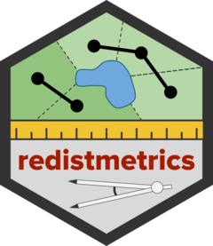

<!-- README.md is generated from README.Rmd. Please edit that file -->

```{r, include = FALSE}
knitr::opts_chunk$set(
  collapse = TRUE,
  comment = "#>",
  fig.path = "man/figures/README-",
  out.width = "100%"
)
```

# redistmetrics <a href="https://alarm-redist.github.io/redistmetrics/"></a>

<!-- badges: start -->
[](https://github.com/alarm-redist/redistmetrics/actions)
<!-- badges: end -->

`redistmetrics` is one of the R packages developed and maintained by the [ALARM Project](https://alarm-redist.github.io/). `redistmetrics` provides the back-end for the computation of summary statistics for a redistricting plan. It provides a more direct access point to use methods in `redist` without requiring `redist` objects.

## Installation

You can install the development version of redistmetrics from [GitHub](https://github.com/alarm-redist/redistmetrics) with:

``` r
if (!requireNamespace('remotes')) install.packages('remotes')
remotes::install_github('alarm-redist/redistmetrics')
```

## Example

```{r}
library(redistmetrics)
```


`redistmetrics` offers support for 4 common input types and has examples of each, all based on New Hampshire:
```{r}
data(nh)
```

This example is based on `comp_polsby()` for the Polsby Popper compactness, but `comp_polsby()` can be substituted for any implemented measure!

#### Single Plan:

For a single plan, we can pass the single plan to the input. We also pass an argument to `shp` which takes in an `sf` dataframe. `r_2020` here is the Republican proposal for New Hampshire's congressional districts.
```{r}
comp_polsby(plans = nh$r_2020, shp = nh)
```

The output here is a numeric vector, where each entry is the output for a district. The first district here has a compactness of about 0.23 and the second district has a compactness of about 0.16.

Now, if you're redistricting in R, we recommend using the R package `redist`. In which case, you would have a `redist_map` object.

We can load an example here with:

```{r}
data(nh_map)
```

For redist maps, the workflow is identical!

```{r}
comp_polsby(plans = nh_map$r_2020, shp = nh)
```

#### Multiple Plans:

For multiple plans, we can pass either a matrix of plans or a `redist_plans` object to plans. We will still need `nh` or `nh_map` to provide the shapes. 

If we have a matrix, we can compare with `nh_m` a matrix of plans, where each column indicates a plan.

```{r}
data(nh_m)
```

From there, the process is nearly identical. Here we compute the Polsby Popper compactness for the first two columns:

```{r}
comp_polsby(plans = nh_m[, 1:2], shp = nh)
```

Now we got 4 outputs: 1 for each district x 2 for each plan x 2 plans.


If we are using `redist`, we likely have a `redist_plans` object which hides the matrix as an attribute to give a more familiar tidy workflow. With that, we can do a very similar process:

First, we load the plans object (included as an example):

```{r}
data(nh_plans)
```

The benefit of using a `redist_plans` object is that we can cleanly `mutate` into it using the `.` shortcut:

```{r}
library(dplyr)
nh_plans <- nh_plans %>% mutate(polsby = comp_polsby(plans = ., shp = nh))
```

Now our values are cleanly held in the `redist_plans` object:
```{r}
head(nh_plans)
```


Detailed information on each measure are contained in the vignettes and references are contained in the function documentation.
